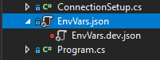
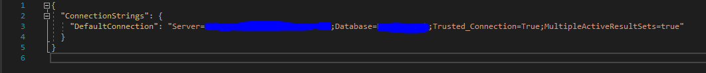

# How to use specific environment development setup.

In this project we utilise environment variables to be able to add a connection string to a local SQL-database in this project without it being pushed to the remote git repository.

What you need to do is just create your own json file called "EnvVars.dev.json" and copy and paste this connection string setup code:

{
  "ConnectionStrings": {
    "DefaultConnection": "Server=[your servername here] ;Database= [your Db name here];Trusted_Connection=True;MultipleActiveResultSets=true"
  }
}

### It should now look something like this:

Simply change the connection string in the file "EnvVars.dev.json"

to match your preferred connection string. 

This connection string is fetched by calling the method "GetConnectionString()" in the static class ConnectionSetup and is used in a DbContext setups "OnCofiguring" method.

In the .gitignore file, all files with the end signature ".dev.json" and ".dev.cs" will be ignored so you don't have to worry about any of your personal info in those files being pushed to the remote repository. To be sure that this is actually happening, you can keep a lookout for the little red sign next to the file in visual studio (encertain if VS Code works exactly the same in this regard but it should be similar). That little red sign in Visual Studio means that the file is ignored.